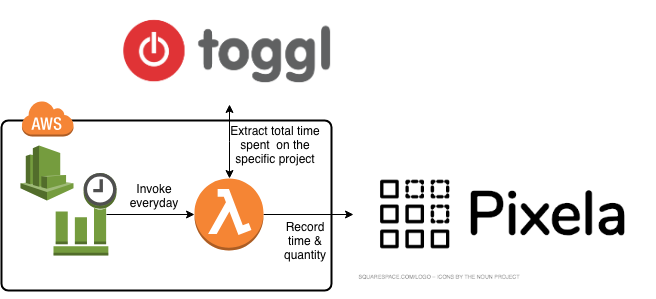

# toggl2pixela
toggl2pixela is a serverless tool to export total time of some tasks (project) recorded in [toggl](https://toggl.com/) to your [Pixela](https://pixe.la/) graph.



## Project setup
### Requirements
- Go environment
- serverless framework

### compile & deploy
```bash
git clone https://github.com/jagijagijag1/toggl2pixela
cd toggl2pixela
```

Describe your toggl bucket info & pixela info to `environment` clause on `serverless.yml`.
If you want, change the time for periodic invoking of Lambda function (default: 16:00 UST = 01:00 JST) in `schedule`.

```yaml:serverless.yml
...
functions:
  toggl2pixela:
    handler: bin/toggl2pixela
    events:
      - schedule: cron(0 16 * * ? *)
    # you need to fill the followings with your own
    environment:
      TZ: Asia/Tokyo
      TOGGL_API_TOKEN: <your-api-token>
      TOGGL_PROJECT_ID: <target-project-id> 
      PIXELA_USER: <user-id>
      PIXELA_TOKEN: <your-token>
      PIXELA_GRAPH: <your-graph-id-1>
    timeout: 10
```

Then, run the following.

```bash
make
sls deploy
```
